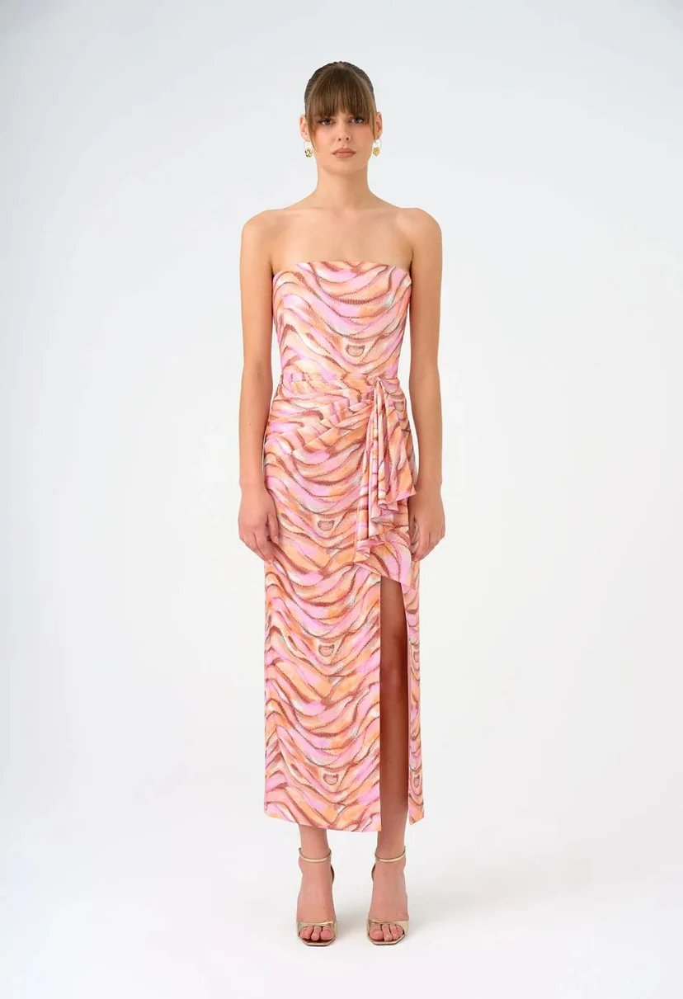

# Virtual Try-On with Stable Diffusion 1.5

## Overview

This project showcases a **Virtual Try-On** system that uses the advanced capabilities of **Stable Diffusion 1.5** and **CAT-VTON** to deliver a realistic virtual clothing experience. The application is designed to help users visualize how different outfits will look on them before making a purchase or simply experimenting with styles.

## Key Technologies

- **Stable Diffusion 1.5**: Provides high-quality, realistic image generation, allowing users to see how clothes would appear on them with stunning detail and accuracy.
- **CAT-VTON**: A cutting-edge clothing transfer model that ensures garments are overlaid with precision, maintaining the integrity of the fabric’s texture and fit for a true-to-life virtual try-on experience.

- **Gradio UI**: Integrated with **Gradio** for a smooth and user-friendly interface, making it easy to upload images, select clothing, and instantly see the results. Gradio’s simplicity and interactivity ensure a hassle-free experience for all users.

## Features

- **Real-Time Visualization**: Upload your image and virtually try on various outfits within seconds.
- **Photorealistic Results**: Achieve near-realistic visualizations with accurate clothing fit and texture preservation.
- **User-Friendly Interface**: Powered by Gradio, the interface is designed for ease of use, making the virtual try-on process accessible and enjoyable.

## Use Cases

This Virtual Try-On tool is ideal for online shoppers, fashion designers, or anyone curious about how different styles will look. It’s a powerful solution for visualizing outfits without the need for physical trials.

<table>
  <tr>
    <th>Input</th>
    <th>Cloth</th>
    <th>Result</th>
  </tr>
  <tr>
    <td></td>
    <td></td>
    <td></td>
  </tr>
</table>
